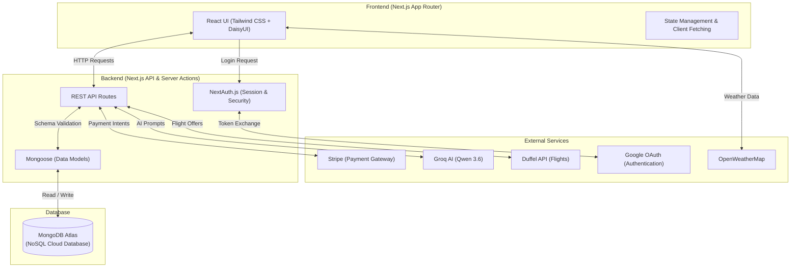

# 🌍 Navora - AI-Powered Travel Booking Platform

**Navora** is a full-stack travel booking platform that revolutionizes how travelers discover and book their next adventure. Powered by cutting-edge AI technology and built with modern web frameworks, Navora combines intelligent destination recommendations with seamless booking experiences.

<div align="center">

[](https://nextjs.org/)
[](https://www.typescriptlang.org/)
[](https://react.dev/)
[](https://www.mongodb.com/)
[](https://stripe.com/)
[](https://tailwindcss.com/)
[](https://groq.com/)
[](https://openweathermap.org/)
[](https://duffel.com/)

<br />

<a href="https://navora-five.vercel.app" target="_blank">
  
</a>

</div>

---

## Table of Contents

- [Key Features](#key-features)
- [Architecture](#architecture)
- [Tech Stack](#tech-stack)
- [Getting Started](#getting-started)
- [Project Structure](#project-structure)
- [API Documentation](#api-documentation)
- [Deployment](#deployment)
- [Security](#security)
- [Project Statistics](#project-statistics)

---

## Key Features

### AI-Powered Recommendations
- **Intelligent Chatbot**: Real-time conversational AI powered by Groq's Qwen 3.6 model.
- **Context-Aware Analysis**: Considers destination category, budget constraints, and group size to give the best suggestions.

### Booking & Payment Management
- **Secure Payment Processing**: Stripe integration with PCI DSS Level 1 compliance.
- **Admin Approval System**: Manual review and rejection workflow with reason tracking.

### Comprehensive Admin Dashboard
- **Full Control**: Manage destinations, bookings, users, and blog posts with full CRUD operations.
- **Analytics**: Real-time KPIs, revenue analytics, and booking trends.

### User Dashboard & Personalization
- **Booking History**: Complete view of all bookings with status tracking.
- **Review System**: 5-star ratings with detailed reviews and photo uploads.

### Dynamic Destination Pages
- **Real-Time Weather Widget**: Live current weather and temperature data powered by OpenWeatherMap API.
- **Live Flight Search**: Real-time international flight tracking, duration, and pricing powered by Duffel API.

---

## Architecture



---

## Tech Stack

### Frontend & Backend
| Technology | Purpose |
|-----------|---------|
| **Next.js** | React framework with App Router and Server Components |
| **React** | Modern UI library |
| **TypeScript** | Type-safe development |
| **TailwindCSS** | Utility-first CSS framework |
| **DaisyUI** | UI Component library |
| **NextAuth.js** | Authentication solution |
| **MongoDB / Mongoose** | NoSQL database and object modeling |

### External Services
| Service | Purpose |
|---------|---------|
| **Stripe** | Payment processing |
| **Groq AI** | AI recommendations |
| **Google OAuth** | Social authentication |
| **OpenWeatherMap** | Live Weather Data |
| **Duffel API** | Flight Search |
| **ImgBB** | Image Storage |

---

## Getting Started

### Installation

1. **Clone the repository**
```bash
git clone https://github.com/SiratimMChy/navora.git
cd navora
npm install
```

2. **Set up environment variables**
Create a `.env.local` file in the root directory:
```env
MONGODB_URI=<your_mongodb_connection_string>
NEXTAUTH_SECRET=your_nextauth_secret_key
NEXTAUTH_URL=http://localhost:3000
GOOGLE_CLIENT_ID=your_google_client_id
GOOGLE_CLIENT_SECRET=your_google_client_secret
NEXT_PUBLIC_IMGBB_API_KEY=your_imgbb_api_key
STRIPE_SECRET_KEY=sk_test_...
NEXT_PUBLIC_STRIPE_PUBLISHABLE_KEY=pk_test_...
GROQ_API_KEY=your_groq_api_key
NEXT_PUBLIC_OPENWEATHER_API_KEY=your_openweathermap_api_key
DUFFEL_API_KEY=your_duffel_api_key
```

3. **Start the development server**
```bash
npm run dev
```

Navigate to `http://localhost:3000` to see the application running.

---

## Project Structure

```text
navora/
├── public/                      # Static assets
│   ├── file.svg
│   ├── globe.svg
│   └── ...
├── src/
│   ├── actions/                 # Server Actions
│   │   └── server/
│   │       └── auth.ts
│   ├── app/                     # Next.js App Router
│   │   ├── (auth)/              # Auth route group
│   │   │   ├── login/
│   │   │   └── register/
│   │   ├── api/                 # API endpoints
│   │   │   ├── admin/
│   │   │   ├── ai/
│   │   │   ├── auth/
│   │   │   ├── blog/
│   │   │   ├── bookings/
│   │   │   ├── destinations/
│   │   │   ├── reviews/
│   │   │   ├── stats/
│   │   │   ├── stripe/
│   │   │   └── users/
│   │   ├── dashboard/           # User & Admin dashboards
│   │   ├── destinations/        # Destination pages
│   │   ├── blog/                # Blog pages
│   │   ├── explore/             # Explore page
│   │   ├── layout.tsx           # Root layout
│   │   ├── page.tsx             # Home page
│   │   └── globals.css          # Global styles
│   ├── components/              # React components
│   │   ├── auth/                # Auth components
│   │   ├── dashboard/           # Dashboard components
│   │   ├── home/                # Home page sections
│   │   ├── layouts/             # Layout components
│   │   └── shared/              # Reusable components
│   ├── lib/                     # Utilities & configurations
│   │   ├── controllers/         # Business logic
│   │   ├── auth.ts              # NextAuth configuration
│   │   ├── mongoose.ts          # MongoDB connection
│   │   └── categoryColors.ts    # UI utilities
│   ├── models/                  # Mongoose schemas
│   │   ├── User.ts
│   │   ├── Destination.ts
│   │   ├── Booking.ts
│   │   ├── Review.ts
│   │   └── BlogPost.ts
│   └── types/                   # TypeScript definitions
│       ├── index.ts
│       └── app.ts
├── .env.local                   # Environment variables
├── .gitignore                   # Git ignore rules
├── eslint.config.mjs            # ESLint configuration
├── next.config.ts               # Next.js configuration
├── package.json                 # Project dependencies
├── tsconfig.json                # TypeScript configuration
└── README.md                    # Project documentation
```

---

## API Documentation

### Destinations & Bookings
| Method | Endpoint | Description | Auth |
|--------|----------|-------------|------|
| `GET` | `/api/destinations` | Fetch destinations with filters | No |
| `POST` | `/api/destinations` | Create a new destination | Admin |
| `GET` | `/api/bookings` | Fetch user's bookings | User |
| `POST` | `/api/bookings` | Create a new booking | User |
| `PATCH` | `/api/admin/bookings` | Approve/reject booking | Admin |

### Users & AI Services
| Method | Endpoint | Description | Auth |
|--------|----------|-------------|------|
| `GET` | `/api/users` | Fetch all users | Admin |
| `PATCH` | `/api/users/:email` | Update user role | Admin |
| `POST` | `/api/ai/recommend` | Get AI recommendations | User |
| `POST` | `/api/ai/generate-description` | Generate content | Admin |

### Payments & Stats
| Method | Endpoint | Description | Auth |
|--------|----------|-------------|------|
| `POST` | `/api/stripe/checkout` | Create checkout session | User |
| `GET` | `/api/stats` | Fetch dashboard statistics | Admin |

---

## Deployment

Navora is optimized for deployment on Vercel. 

1. **Push your code to GitHub.**
2. **Connect to Vercel**: Import your GitHub repository into your Vercel dashboard.
3. **Configure Environment Variables**: Add all your `.env` variables to the Vercel project settings.
4. **Deploy**: Vercel automatically builds and deploys your application.

---

## Security

- **Authentication**: Industry-standard authentication via NextAuth.js.
- **Authorization**: Strict role-based access control for Admins, Users, and Guests.
- **Data Protection**: Passwords hashed securely using `bcryptjs`. Sensitive API keys are strictly kept server-side.
- **Payments**: Stripe PCI DSS Level 1 compliance for all transactions.

---

## Project Statistics

- **Stack**: Next.js + React + TypeScript + MongoDB + Stripe + Groq AI + Duffel API
- **Total Lines of Code**: 15,000+
- **React Components**: 30+
- **API Endpoints**: 20+
- **Supported Devices**: Desktop, Tablet, Mobile

---

<div align="center">

**Made by Siratim Mustakim Chowdhury**

[](https://github.com/SiratimMChy)
[](https://www.linkedin.com/in/siratim-mustakim-chowdhury/)
[](mailto:chowdhurysiratimmustakim@gmail.com)

</div>
